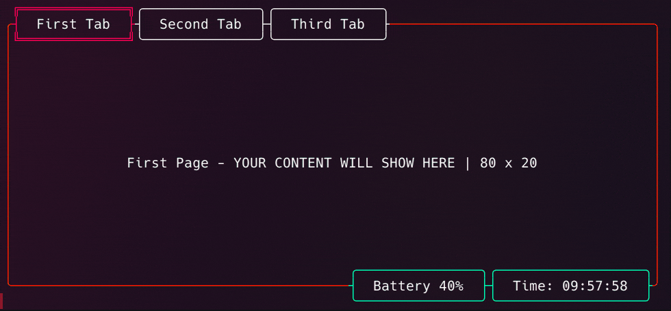

# Skeleton

**Skeleton** is a Go library built on top of the [Bubble Tea](https://github.com/charmbracelet/bubbletea) framework designed to simplify the development of multi-tab terminal user interface (TUI) applications.

**Caution: This project is under active development and may have breaking changes for a while.**

<a href="https://github.com/termkit/skeleton" target="_blank"></a>
<a href="https://goreportcard.com/report/github.com/termkit/skeleton" target="_blank"></a>
<a href="https://github.com/termkit/skeleton" target="_blank"></a>



## Features

- **Multi-tab Support**: Easily create and manage multiple tabs in your terminal application, similar to browser tabs.
- **Dynamic Widgets**: Add and update widgets on the screen, such as battery status, time, or any other information.
- **Simple Integration**: Build complex TUI applications with a straightforward and modular approach.
- **Customizable**: You can customize every aspect of the tabs and widgets, including key bindings and appearance. 
- **Realtime Updates**: Updates itself instantly every time the terminal is resized, appearance changes, widgets changes, content changes, etc.
- **Responsive Design**: Automatically adjusts the layout based on the terminal size.

## Tutorial

Skeleton leverages Bubble Tea's architecture to provide a framework for multi-tab TUI applications. This tutorial assumes you have a working knowledge of Go and Bubble Tea.

For a complete example code, you can refer to the [source code on GitHub](https://github.com/termkit/skeleton/tree/main/examples).

### Getting Started

First, you'll need to install Skeleton. Use the following command to get it:

````bash
go get github.com/termkit/skeleton
````

### Example Usage

Let's walk through an example of how to use Skeleton to create a basic multi-tab application.

#### 1. Define the Models

We'll start by defining a simple model for our tabs. Each tab will be represented by a `tinyModel` struct:

````go
package main

import (
	"fmt"
	"strings"

	"github.com/termkit/skeleton"
	"github.com/charmbracelet/bubbles/key"
	tea "github.com/charmbracelet/bubbletea"
)

type tinyModel struct {
	skeleton *skeleton.Skeleton
	title    string
}

func newTinyModel(skeleton *skeleton.Skeleton, title string) *tinyModel {
	return &tinyModel{
		skeleton: skeleton,
		title:    title,
	}
}

func (m tinyModel) Init() tea.Cmd { return nil }
func (m tinyModel) Update(msg tea.Msg) (tea.Model, tea.Cmd) {
	return m, nil
}
func (m tinyModel) View() string {
	verticalCenter := m.skeleton.GetTerminalHeight()/2 - 3
	requiredNewLines := strings.Repeat("\n", verticalCenter)
	return fmt.Sprintf("%s%s | %d x %d", requiredNewLines, m.title, m.skeleton.GetTerminalWidth(), m.skeleton.GetTerminalHeight())
}
````

#### 2. Set Up the Application

Initialize Skeleton, add pages, and configure widgets:

````go
func main() {
	s := skeleton.NewSkeleton()

	// Add tabs (pages)
	s.AddPage("first", "First Tab", newTinyModel(s, "First"))
	s.AddPage("second", "Second Tab", newTinyModel(s, "Second"))
	s.AddPage("third", "Third Tab", newTinyModel(s, "Third"))

	// Set up key bindings ( Optional | Defaults: ctrl+left, ctrl+right )
	//To switch next page
	s.KeyMap.SwitchTabRight = key.NewBinding(
		key.WithKeys("shift+right"))

	// To switch previous page
	s.KeyMap.SwitchTabLeft = key.NewBinding(
		key.WithKeys("shift+left"))

	// Add a widget to entire screen
	s.AddWidget("battery", "Battery %92")
	s.AddWidget("time", time.Now().Format("15:04:05"))

	// Update the time widget every second
	go func() {
		time.Sleep(time.Second)
		for {
			s.UpdateWidgetValue("time", time.Now().Format("15:04:05"))
			time.Sleep(time.Second)
		}
	}()

	p := tea.NewProgram(s)
	if err := p.Start(); err != nil {
		panic(err)
	}
}
````

### Understanding the Code

1. **Model Definition**: `tinyModel` represents the content of each tab. It uses the Skeleton instance to query terminal dimensions and display information.

2. **Application Setup**: The `main` function initializes Skeleton, adds pages, and sets up widgets. The time widget updates every second to reflect the current time.

## Skeleton in the Wild
Some programs that use Skeleton in production:

- [gama](https://github.com/termkit/gama): Manage your GitHub Actions from Terminal with great UI 🧪

## Documentation

For more detailed documentation and additional examples, please refer to the [Wiki](https://github.com/termkit/skeleton/wiki) or the [Documentation](https://github.com/termkit/skeleton/docs).

## Contributing

Contributions are what make the open source community such an amazing place to learn, inspire, and create. Any contributions you make are **greatly appreciated**.

## License

Distributed under the GNU GENERAL PUBLIC LICENSE Version 3 or later. See [LICENSE](LICENSE) for more information.

## Contact & Author

[Engin Açıkgöz](https://github.com/canack)

## Stargazers over time

[](https://starchart.cc/termkit/skeleton)