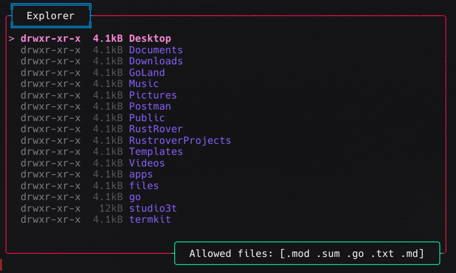

# Example usages of the `skeleton` package

### Basic Tab Example
This example demonstrates how to create a tabs and widgets using the `skeleton` package. \
You can switch tabs with `ctrl+left` and `ctrl+right` keys.\
You can exit the application by pressing `ctrl+c` keys.\
`Note: You can override the default key bindings by providing your own key bindings.`

### File Reader
Basic file reader example using the `skeleton` package. \
Keys: `ctrl+left` and `ctrl+right` to switch tabs, `ctrl+w` to close the tab, `ctrl+c` to exit the application.

